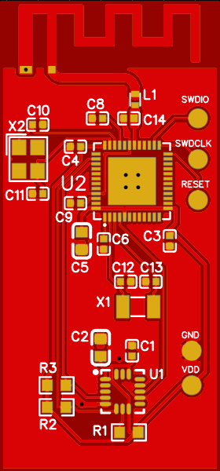

# Rydful Beacon



A motion-triggered BLE beacon application for Nordic nRF52 microcontrollers using the Zephyr RTOS. The device remains in sleep mode until motion is detected via an LIS3DH accelerometer, then starts BLE advertising to enable presence detection.

Designed for Rydful App: https://rydful.com

<br clear="left">

## Features

- **Hardware Interrupt-Driven Wake** – LIS3DH accelerometer's internal motion engine triggers MCU wake via GPIO interrupt (P0.02/INT1)
- **Ultra-Low Power Sleep** – MCU sleeps indefinitely with `k_sem_take(K_FOREVER)` until motion interrupt occurs (~3.9 µA total idle current)
- **Motion-Triggered Advertising** – BLE advertising starts only when motion exceeds hardware threshold (32mg default)
- **High-Pass Filtered Detection** – Gravity filtered out at 1Hz ODR in hardware, only acceleration changes trigger interrupt
- **Advertising Duty Cycling** – During active mode, advertising cycles 5s on / 7s off (~42% duty cycle) to reduce average power by ~45%
- **Configurable Timeouts** – Advertising stops after configurable period of no motion (default: 36 seconds, 3 full duty cycles)
- **Battery Voltage Monitoring** – ADC-based battery voltage measurement with percentage calculation, included in BLE advertising data (updated every 5 minutes)
- **Direct I2C Register Access** – Bypasses Zephyr sensor framework for reliable interrupt configuration
- **Android CDM Compatible** – 250-400ms connectable/scannable advertising interval for reliable companion app discovery


## Hardware Requirements

- **MCU**: Nordic nRF52832 (nRF52 DK)
- **Accelerometer**: LIS3DH or LIS2DH (I2C interface)
- **Battery**: 2.0-3.6V input (CR2032, 2× AAA/AA alkaline or lithium)

### Wiring (nRF52 DK with LIS3DH)

| LIS3DH Pin | nRF52 DK Pin | Description |
|------------|--------------|-------------|
| SDA        | P0.26        | I2C Data    |
| SCL        | P0.27        | I2C Clock   |
| INT1       | P0.02        | Motion interrupt (required for low-power wake) |
| -          | P0.03 (AIN1) | Battery voltage input |

## Supported Boards

| Board | Description | Use Case |
|-------|-------------|----------|
| `nrf52dk_nrf52832` | Nordic nRF52 DK | Development/testing with external LIS3DH |
| `rydful_custom` | Custom PCB | Production board with integrated LIS3DH |

## Configuration

### Hardware Motion Detection Parameters

These are defined in `src/main.c`:

| Parameter | Default | Description |
|-----------|---------|-------------|
| `HW_MOTION_THRESHOLD_MG` | 32 mg | Acceleration threshold for motion detection |
| `HW_MOTION_DURATION` | 2 samples | Required samples above threshold (debounce) |
| `NO_MOTION_TIMEOUT_SEC` | 36 | Seconds of no motion before stopping advertising (3 full duty cycles) |
| `ADV_DUTY_ON_SEC` | 5 | Seconds of advertising per duty cycle |
| `ADV_DUTY_OFF_SEC` | 7 | Seconds of radio silence per duty cycle |

The LIS3DH operates at **1Hz ODR** in low-power mode (~2µA) and uses its internal high-pass filter to remove gravity, so only acceleration *changes* trigger the interrupt. Wake latency is ~1 second.

### Battery Monitoring

| Parameter | Default | Description |
|-----------|---------|-------------|
| `BATTERY_LOW_THRESHOLD_MV` | 2000 mV | 0% battery threshold |
| `BATTERY_FULL_MV` | 3000 mV | 100% battery threshold |
| `BATTERY_UPDATE_INTERVAL_SEC` | 300 | Battery status update interval (5 minutes) |

### BLE Configuration

- **Device Name**: `Rydful_Beacon` (configurable via `CONFIG_BT_DEVICE_NAME`)
- **Service UUID**: `0xFEAA` (16-bit)
- **Manufacturer ID**: `0xFFFF` (development/testing)
- **Advertising Interval**: 250-400 ms (required for Android CDM compatibility)
- **Mode**: Connectable, scannable

### BLE Advertising Data

The manufacturer-specific data contains:
- Bytes 0-1: Manufacturer ID
- Byte 2: Battery percentage (0-100)
- Byte 3: Low battery flag (0x00 or 0x01)

## Building

### Prerequisites

- [nRF Connect SDK](https://docs.nordicsemi.com/bundle/ncs-latest/page/nrf/installation.html) installed
- West tool configured

### Build Commands

```bash
# Build for nRF52 DK (development/testing with external accelerometer)
west build -b nrf52dk/nrf52832 -p

# Build for Rydful Custom PCB (production board)
west build -b rydful_custom -p -- -DBOARD_ROOT=.
```

### Flash

```bash
# Flash nRF52 DK (direct connection)
west flash
```

## Flashing Custom PCB via nRF52 DK

The nRF52 DK can be used as a J-Link programmer to flash the custom PCB.

### Hardware Setup

1. **Disconnect** the nRF52 DK from USB
2. **Set the nRF power switch** to "VDD" (not "USB") on the DK
3. **Connect SWD wires** from DK P20 header to your custom PCB:

| DK P20 Pin | Custom PCB | Description |
|------------|------------|-------------|
| SWDIO      | SWDIO      | Debug data  |
| SWDCLK     | SWDCLK     | Debug clock |
| GND        | GND        | Ground      |
| VTG        | VDD        | Target voltage sense (optional) |

4. **Power the custom PCB** via its own power source (external supply)
5. **Connect DK to USB** for programming

### Flash Command

```bash
# Build for custom PCB
west build -b rydful_custom -p -- -DBOARD_ROOT=.

# Flash via J-Link
west flash
```

### Troubleshooting

- **"No target detected"** – Check SWD wiring, ensure custom PCB is powered
- **"Could not connect"** – Verify SWDIO/SWDCLK connections, check for shorts
- **Use nRF Connect Programmer** – Alternative GUI tool for flashing `.hex` files from `build/zephyr/zephyr.hex`

### Using nrfjprog (Alternative)

```bash
# Erase and flash
nrfjprog --program build/zephyr/zephyr.hex --chiperase --verify
nrfjprog --reset
```

## How It Works

### State Machine

```
┌─────────────────────────────────────────────────────────────┐
│  SLEEP MODE                                                 │
│  • LIS3DH: Hardware threshold interrupt (>32mg) @ 1Hz       │
│  • nRF52: System ON sleep with LFXO (~1.8 µA)               │
│  • Total: ~3.9 µA                                           │
└──────────────────────┬──────────────────────────────────────┘
                       │ Motion exceeds threshold (~2s latency)
                       ▼
┌─────────────────────────────────────────────────────────────┐
│  ACTIVE MODE (duty-cycled: 5s ON / 7s OFF)                  │
│  • ON:  BLE advertising (connectable, 250-400ms, -12dBm TX) │
│  • OFF: Radio silent, MCU polling for motion (max 7s gap)   │
│  • Each motion interrupt resets 36-second timeout           │
│  • Duty cycle runs independently of motion events           │
│  • Average: ~30 µA                                          │
└──────────────────────┬──────────────────────────────────────┘
                       │ No motion for 36 seconds
                       ▼
              Back to SLEEP MODE
```

### Usage

1. **Power on** – Initialization sequence
2. **Sleep mode** – No BLE advertising, ultra-low power (~3.9 µA)
3. **Motion detected** – BLE advertising starts (~1 second wake latency)
4. **Active mode** – Advertising duty-cycles 5s on / 7s off; each motion event resets the 36-second timeout
5. **No motion** – After 36 seconds of no motion, advertising stops

### Monitoring

Connect via RTT console (production PCB) or serial (115200 baud) to view logs.

## Power Consumption

*Note: All estimates are for the production PCB (nRF52832 + LIS3DHTR + passives only).*

### Current Draw by State

| State | Current | Description |
|-------|---------|-------------|
| Sleep | ~3.9 µA | nRF52 System ON (~1.8µA with LFXO) + LIS3DH @ 1Hz (~2µA) |
| Active (duty-cycled) | ~30 µA avg | 5s advertising / 7s silent duty cycle (~42% radio on) |
| Active (ON phase) | ~55 µA | BLE connectable advertising @ 250-400ms, -12dBm TX |
| Active (OFF phase) | ~13 µA | Radio off, CPU polling for motion |
| Peak (TX burst) | ~7.5 mA | During BLE transmit events @ -12dBm (~380µs per event) |

### Component Breakdown (Sleep Mode)

| Component | Current | Notes |
|-----------|---------|-------|
| nRF52832 System ON (LFXO) | ~1.8 µA | RAM retained, RTC running, external 32.768kHz crystal |
| LIS3DHTR @ 1Hz LP mode | ~2 µA | Interrupt engine active, HP filter, 1s wake latency |
| GPIO leakage | ~0.1 µA | Minimal with proper configuration |
| **Total Sleep** | **~3.9 µA** | |

### Component Breakdown (Active Mode – ON Phase, 5s)

| Component | Current | Notes |
|-----------|---------|-------|
| BLE advertising | ~40 µA | 250-400ms interval, connectable/scannable, -12dBm TX |
| LIS3DHTR @ 1Hz | ~2 µA | Same ODR as sleep |
| ADC sampling (periodic) | ~1 µA avg | Brief spikes every 5 minutes |
| CPU overhead | ~10-12 µA | Processing interrupts, state management |
| **Total ON Phase** | **~55 µA** | 0.055 mA |

### Component Breakdown (Active Mode – OFF Phase, 7s)

| Component | Current | Notes |
|-----------|---------|-------|
| BLE advertising | 0 µA | Radio off |
| LIS3DHTR @ 1Hz | ~2 µA | Same ODR as sleep |
| ADC sampling (periodic) | ~1 µA avg | Brief spikes every 5 minutes |
| CPU overhead | ~10 µA | Polling loop (500ms wake intervals) |
| **Total OFF Phase** | **~13 µA** | 0.013 mA |

### Duty-Cycled Active Mode Average

```
I_active_avg = (I_on × T_on + I_off × T_off) / (T_on + T_off)
             = (55µA × 5s + 13µA × 7s) / (5s + 7s)
             = (275 + 91) / 12
             ≈ 30 µA (0.030 mA)
```

### Power Optimizations Applied

| Optimization | Impact | Trade-off |
|--------------|--------|-----------|
| External 32.768kHz LFXO | ~70% MCU sleep reduction vs RC oscillator | None (hardware present) |
| Reduced TX power (-12dBm) | ~25% peak TX reduction, minimal avg impact | Tight 5m discovery range |
| LIS3DH 1Hz ODR | ~64% sensor sleep reduction | 1 second wake latency |
| **Advertising duty cycle (5s/7s)** | **~45% active mode reduction** (55→30 µA) | Up to 7s discovery gap |
| 36s no-motion timeout (3 duty cycles) | Minimizes active time | Aligned to duty cycle period |
| 5-minute battery updates | Negligible impact (<1 µA) | Less frequent battery status |

---

## Battery Life Calculations

*Production PCB with power optimizations: 1Hz accelerometer ODR, 5s/7s advertising duty cycle, 36s timeout, 5-min battery updates.*

### Supported Power Sources

| Battery Type | Nominal Voltage | Typical Capacity | Effective Capacity* |
|--------------|-----------------|------------------|---------------------|
| CR2032 | 3.0V | 225 mAh | ~150 mAh** |
| 2× AAA Alkaline | 3.0V (1.5V × 2) | 1,200 mAh | ~1,000 mAh |
| 2× AA Alkaline | 3.0V (1.5V × 2) | 2,850 mAh | ~2,400 mAh |
| 2× AA Lithium | 3.0V (1.5V × 2) | 3,500 mAh | ~3,000 mAh |

*Effective capacity accounts for ~15-20% derating due to voltage cutoff (2.0V minimum), temperature, and discharge curve.

**CR2032 Pulse Current Derating:** CR2032 batteries experience significant capacity reduction under pulse loads. While average current is low (~55 µA active), the 7.5 mA TX peaks (though brief, ~380µs every 325ms) cause additional derating. Effective capacity reduced from nominal 225 mAh to ~150 mAh for this application. For comparison: at 0.5 mA continuous draw CR2032 provides ~240 mAh, but at 3.0 mA only ~155 mAh remains available.

### Usage Pattern Definitions

| Pattern | Description | Daily Active Time | Trips/Day |
|---------|-------------|-------------------|-----------|
| **Parked Vehicle** | Garaged/parked, minimal vibration | ~5-15 min | 0-1 |
| **Weekend Rider** | Motorcycle/classic car, weekend use only | ~2-4 hours | 1-2 (weekends only) |
| **Commuter** | Daily work commute, 2× per day ~1h each | ~2 hours | 2 |
| **Daily Driver** | Multiple short trips throughout day | ~3 hours | 4-6 |
| **Heavy Use** | Delivery/rideshare, constant use | ~8-12 hours | 10-20 |

### Battery Life Formula

```
Total Daily Consumption (mAh/day) = (I_sleep × T_sleep) + (I_active × T_active)

Where:
  I_sleep  = 0.0039 mA (3.9 µA with external LFXO)
  I_active = 0.030 mA (duty-cycled average: 5s ON @ 55µA, 7s OFF @ 13µA)
  T_sleep  = 24 - T_active (hours)
  T_active = Active hours per day + (trips × timeout / 3600)
  timeout  = 36 seconds (advertising continues after last motion, 3 duty cycles)

Battery Life (days) = Effective_Capacity / Daily_Consumption
```

### Detailed Lifetime Estimates

#### CR2032 (150 mAh effective, pulse-derated)

| Usage Pattern | Active Hours/Day | Daily Draw (mAh) | Estimated Life |
|---------------|------------------|------------------|----------------|
| Parked Vehicle | 0.26h | 0.10 | **1,500 days** (~4.1 years)† |
| Weekend Rider | 0.59h (avg)* | 0.11 | **1,376 days** (~3.8 years)† |
| Commuter (2×/day) | 2.02h | 0.15 | **1,027 days** (~2.8 years) |
| Daily Driver | 3.05h | 0.17 | **867 days** (~2.4 years) |
| Heavy Use | 8.15h | 0.31 | **490 days** (~1.3 years) |

*Weekend rider averaged over 7 days
†CR2032 self-discharge ~10-15% per year; practical life 2-3 years for commuter/daily use due to pulse derating and environmental factors

#### 2× AAA Alkaline (1,000 mAh effective)

| Usage Pattern | Active Hours/Day | Daily Draw (mAh) | Estimated Life |
|---------------|------------------|------------------|----------------|
| Parked Vehicle | 0.26h | 0.10 | **10,000 days** (~27.4 years)† |
| Weekend Rider | 0.59h (avg) | 0.11 | **9,174 days** (~25.1 years)† |
| Commuter (2×/day) | 2.02h | 0.15 | **6,849 days** (~18.8 years)† |
| Daily Driver | 3.05h | 0.17 | **5,780 days** (~15.8 years)† |
| Heavy Use | 8.15h | 0.31 | **3,268 days** (~8.9 years)† |

†Limited by battery self-discharge (~2-3% per year), practical limit ~5-7 years.

#### 2× AA Alkaline (2,400 mAh effective)

| Usage Pattern | Active Hours/Day | Daily Draw (mAh) | Estimated Life |
|---------------|------------------|------------------|----------------|
| Parked Vehicle | 0.26h | 0.10 | **24,000 days** (~66 years)† |
| Weekend Rider | 0.59h (avg) | 0.11 | **22,018 days** (~60 years)† |
| Commuter (2×/day) | 2.02h | 0.15 | **16,438 days** (~45 years)† |
| Daily Driver | 3.05h | 0.17 | **13,873 days** (~38 years)† |
| Heavy Use | 8.15h | 0.31 | **7,843 days** (~21 years)† |

†Alkaline batteries self-discharge ~2-3% per year. Actual life limited to ~5-7 years maximum regardless of load.

#### 2× AA Lithium (3,000 mAh effective)

| Usage Pattern | Active Hours/Day | Daily Draw (mAh) | Estimated Life |
|---------------|------------------|------------------|----------------|
| Parked Vehicle | 0.26h | 0.10 | **30,000 days** (~82 years)† |
| Weekend Rider | 0.59h (avg) | 0.11 | **27,523 days** (~75 years)† |
| Commuter (2×/day) | 2.02h | 0.15 | **20,548 days** (~56 years)† |
| Daily Driver | 3.05h | 0.17 | **17,341 days** (~47 years)† |
| Heavy Use | 8.15h | 0.31 | **9,804 days** (~27 years)† |

†Lithium batteries have ~1% annual self-discharge. Practical limit ~10 years.

### Commuter Scenario Deep Dive (2× daily, ~1h each)

This is a common use case: daily work commute with two trips.

**Calculation breakdown:**
- Morning commute: 1 hour active
- Evening commute: 1 hour active
- Post-trip timeout: 36 seconds × 2 trips = 1.2 minutes
- **Total active time**: 2h 1.2min/day ≈ 2.02 hours

**Daily energy consumption:**
```
Sleep:   (24 - 2.02)h × 0.0039mA = 0.086 mAh
Active:  2.02h × 0.030mA         = 0.061 mAh
─────────────────────────────────────────────
Total:                           = 0.146 mAh/day
```

| Battery Type | Capacity | Estimated Life | Practical Reality |
|--------------|----------|----------------|-------------------|
| CR2032 | 150 mAh | **1,027 days** (~2.8 years) | 2-3 years typical |
| 2× AAA | 1,000 mAh | **6,849 days** (~18.8 years)† | 5-7 years (self-discharge limit) |
| 2× AA | 2,400 mAh | **16,438 days** (~45 years)† | 5-7 years (self-discharge limit) |
| 2× AA Lithium | 3,000 mAh | **20,548 days** (~56 years)† | 10+ years (self-discharge limit) |

†Limited by battery self-discharge, not device consumption

### Temperature Impact

Battery performance degrades significantly in extreme temperatures:

| Temperature | Capacity Factor | Notes |
|-------------|-----------------|-------|
| -20°C to -10°C | 50-70% | Severe cold reduces capacity |
| -10°C to 0°C | 70-85% | Cold weather impact |
| 0°C to 25°C | 85-100% | Optimal operating range |
| 25°C to 45°C | 90-100% | Warm, generally fine |
| >45°C | Reduced lifespan | Accelerated self-discharge |

**Recommendation**: For vehicles parked outdoors in extreme climates, use **lithium primary cells** (2× AA Lithium) which maintain 90%+ capacity down to -40°C.

### Battery Selection Guide

| Use Case | Recommended | Rationale |
|----------|-------------|-----------|
| **Motorcycle (Weekend)** | 2× AAA | AAA: 5-7 years (self-discharge limited), better than CR2032 for longevity |
| **Daily Commuter** | 2× AAA | **5-7 years** (self-discharge limited), compact form factor |
| **Daily Commuter (extended)** | 2× AA | **5-7 years** (self-discharge limited), best longevity |
| **Delivery Vehicle** | 2× AA or 2× AA Lithium | AA: ~5 years, Lithium: 10+ years |
| **Garage Queen** | 2× AAA | Multi-year life, minimal replacement (AAA better than CR2032) |
| **Extreme Cold Climate** | 2× AA Lithium | Maintains capacity at low temps, 10+ years |
| **Compact Installation** | CR2032 | Small size, **2-3 years typical** (pulse current limits lifespan) |

### Quick Reference: Months Until Replacement

|  | CR2032** | 2× AAA | 2× AA | 2× AA Li |
|--|--------|--------|-------|----------|
| **Parked** | 49 mo | 60+ mo* | 60+ mo* | 120+ mo* |
| **Weekend** | 45 mo | 60+ mo* | 60+ mo* | 120+ mo* |
| **Commuter** | **34 mo** | 60+ mo* | 60+ mo* | 120+ mo* |
| **Daily** | 28 mo | 60+ mo* | 60+ mo* | 120+ mo* |
| **Heavy** | 16 mo | 60+ mo* | 60+ mo* | 120+ mo* |

*Limited by battery self-discharge (~5-7 years for alkaline, ~10 years for lithium), not device consumption
**CR2032 estimates account for pulse current derating; real-world life often 2-3 years for commuter/daily use due to environmental factors

---

## Case Designs

The project includes 3D-printable case designs for different battery configurations:

### Available Cases

| Case Type | Battery | Design File | STL Files | Dimensions | Features |
|-----------|----------|-------------|-----------|------------|----------|
| **Circular** | CR2032 | `circular.scad` | `circular_base.stl`, `circular_lid.stl` | Ø35mm × 12.5mm | Compact circular design, snap-fit lid, mounting tabs |
| **Rectangular** | 2×AA | `rectangular.scad` | `rectangular_base.stl`, `rectangular_lid.stl` | 89mm × 40mm × 15mm | Side-by-side AA batteries, spring contacts, PCB rails |

### Case Features

**Circular Case**
- Designed for CR2032 coin cell battery
- 30mm diameter circular PCB mounting
- 3 tapered support nubs at 90°/210°/330° angles
- Snap-fit lid with 0.05mm interference fit for MJF printing
- Mounting tabs with 3.2mm screw holes
- "Rydful" engraved text on lid
- Fingernail pry notches for easy lid removal

**Rectangular Case**
- Designed for 2×AA batteries in side-by-side configuration
- Spring contact pockets for reliable battery connections
- PCB slide-in rails with L-shaped channels
- 4 corner standoffs for PCB support
- Divider wall between battery and PCB sections
- Snap-fit lid with multiple engagement points
- Battery cradle with cylindrical channels
- "Rydful" engraved text on lid

### 3D Printing

- **Recommended material**: MJF (Multi Jet Fusion) or FDM with PETG/ABS
- **Layer height**: 0.2mm for FDM
- **Infill**: 20-30% (cases are primarily hollow)
- **Orientation**: Print with flat side down for best surface finish
- **Post-processing**: Remove support material, check snap-fit engagement

### Assembly

1. Install batteries in designated compartments
2. Route PCB into case (slide-in rails for rectangular case)
3. Ensure proper alignment of snap-fit features
4. Press lid firmly until snap engagement is felt
5. Test lid removal using pry notches if needed

SPDX-License-Identifier: Apache-2.0
